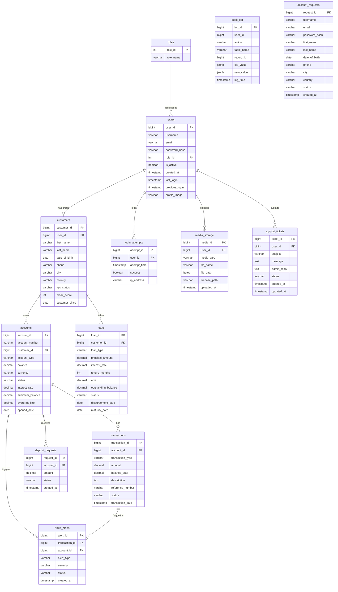
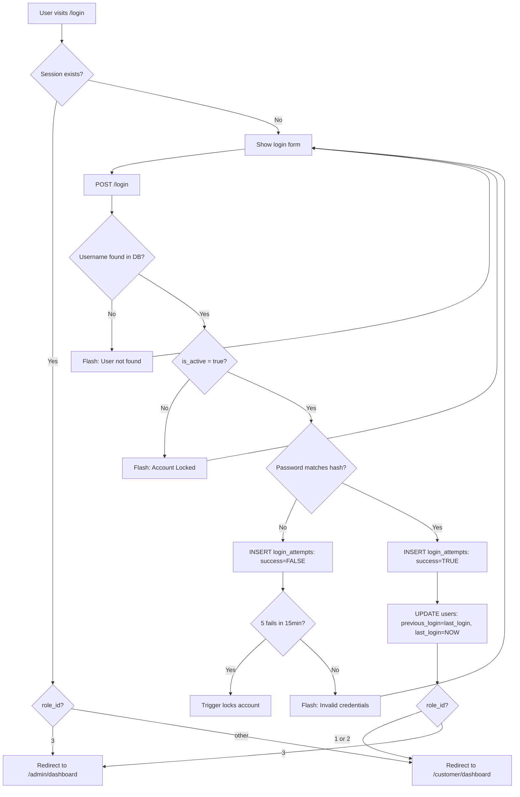
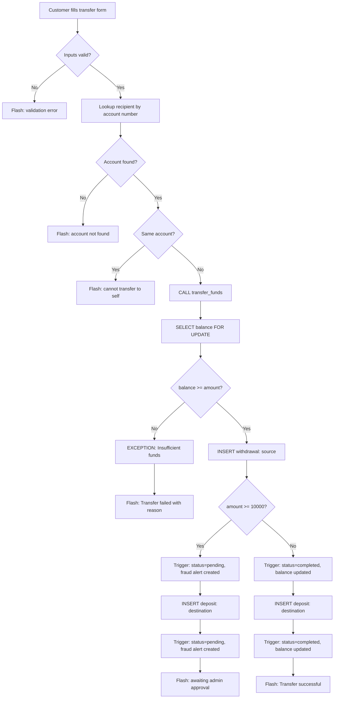
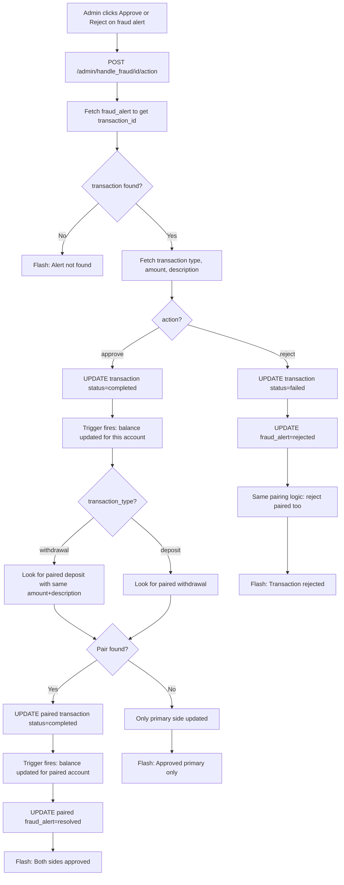
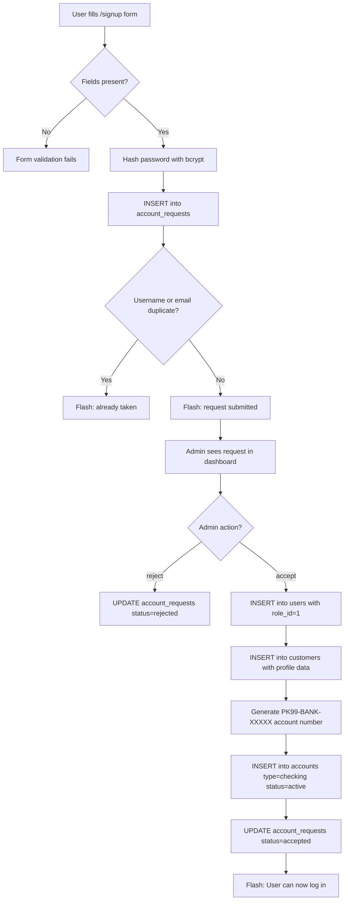
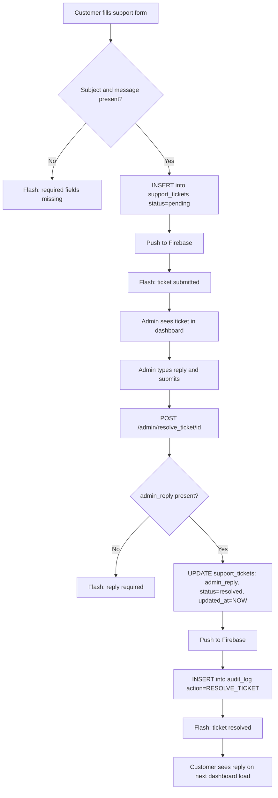
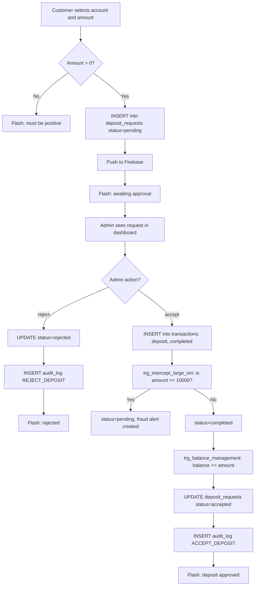

# BankSim - Technical Reference

This document is for internal use. It covers the full database design, all SQL objects explained, UI flow diagrams, edge cases, and constraints. Not tracked in version control.

---

## Table of Contents

1. [ER Diagram](#er-diagram)
2. [Schema Reference](#schema-reference)
3. [Triggers](#triggers)
4. [Views](#views)
5. [Stored Procedures and Functions](#stored-procedures-and-functions)
6. [UI Flow Diagrams](#ui-flow-diagrams)
7. [Edge Cases and Constraints](#edge-cases-and-constraints)

---

## ER Diagram



---

## Schema Reference

### roles
Lookup table. Populated once via seed_data.sql. Never changed at runtime.

| Column | Type | Notes |
|---|---|---|
| role_id | SERIAL PK | 1=customer, 2=teller, 3=admin, 4=fraud_analyst |
| role_name | VARCHAR(50) UNIQUE | |

### users
Central authentication table. Linked to customers via 1-to-1 FK.

| Column | Type | Notes |
|---|---|---|
| user_id | BIGSERIAL PK | |
| username | VARCHAR(50) UNIQUE | Used for login |
| email | VARCHAR(255) UNIQUE | |
| password_hash | VARCHAR(255) | bcrypt hash |
| role_id | INT FK | References roles |
| is_active | BOOLEAN | false = account locked |
| last_login | TIMESTAMP | Updated on each successful login |
| previous_login | TIMESTAMP | Set to old last_login before updating |
| profile_image | VARCHAR(255) | Relative path: `profile_pics/user_id.ext` |

### customers
Separated from users per 3NF. Holds personal/demographic data.

| Column | Type | Notes |
|---|---|---|
| customer_id | BIGSERIAL PK | |
| user_id | BIGINT UNIQUE FK | One customer per user |
| kyc_status | VARCHAR(20) | pending / verified / rejected |
| credit_score | INT | Default 600 |

### accounts
One customer can have multiple accounts. Account numbers use format `PK99-BANK-XXXXX`.

| Column | Type | Notes |
|---|---|---|
| account_type | VARCHAR(20) | CHECK: checking, savings, credit, loan, business |
| status | VARCHAR(20) | active / pending / closed |
| balance | DECIMAL(15,2) | Updated only via triggers, never directly |
| interest_rate | DECIMAL(5,4) | Default 0.03 (3%) |

### transactions
Partitioned by `transaction_date` into `transactions_2025` and `transactions_2026`. Always insert via the parent table; PostgreSQL routes to the correct partition automatically.

| Column | Type | Notes |
|---|---|---|
| transaction_type | VARCHAR(20) | CHECK: deposit, withdrawal, transfer, payment, fee |
| status | VARCHAR(20) | completed / pending / failed |
| balance_after | DECIMAL(15,2) | Snapshot set by trigger after balance update |

### deposit_requests
Customer cannot deposit directly. They submit a request; admin approves it.

| Column | Type | Notes |
|---|---|---|
| status | VARCHAR(20) | pending / accepted / rejected |

### account_requests
New users submit signup requests. Admin approves to create the user and their first account.

### support_tickets
Customer submits subject + message. Admin replies via `admin_reply`. Status moves from pending to resolved.

### fraud_alerts
Auto-created by trigger for any transaction >= 10,000. References both the transaction and the account. Status: open / resolved / rejected.

### audit_log
Admin actions are manually written here (accept/reject deposit, resolve ticket). Not auto-populated by triggers currently.

### login_attempts
Every login attempt (success or failure) is recorded. Used by the auto-lockout trigger.

---

## Triggers

### 1. trg_login_lockout

**File:** triggers.sql  
**Table:** login_attempts  
**Fires:** AFTER INSERT (every login attempt)

**Logic:**
```sql
-- Count failed attempts in last 15 minutes for this user
-- If count >= 5, set users.is_active = FALSE
```

**Effect:** The user account is immediately deactivated. The admin must manually toggle it back via the dashboard.

**Edge cases:**
- Counter resets naturally as attempts age out of the 15-minute window
- A single successful login does NOT reset the counter — the user must wait or contact admin

---

### 2. trg_intercept_large_txn

**File:** triggers.sql  
**Table:** transactions  
**Fires:** BEFORE INSERT

**Logic:**
```sql
-- If amount >= 10000 AND description != 'Admin-Approved Cash Deposit'
--   SET NEW.status = 'pending'
```

**Effect:** Large transactions are held pending. Balance is NOT updated yet. The balance trigger only fires when status is `completed`.

**Edge cases:**
- Admin-approved deposits bypass this check via the description sentinel
- Transfer procedure inserts two rows (withdrawal + deposit); both are intercepted

---

### 3. trg_balance_management

**File:** triggers.sql  
**Table:** transactions  
**Fires:** AFTER INSERT OR UPDATE

**Logic:**
```sql
-- Guard: if pg_trigger_depth() > 1, return immediately (prevent recursion)
-- On INSERT with status='completed' OR UPDATE from pending to completed:
--   deposit  -> accounts.balance += amount
--   withdrawal/transfer/payment/fee -> accounts.balance -= amount
--   Then UPDATE transactions SET balance_after = new_balance
```

**Effect:** Single source of truth for balance changes. The inner UPDATE on transactions re-triggers this trigger, but the depth guard exits it immediately.

**Edge cases:**
- If a transaction is inserted as `pending`, balance is NOT touched
- When admin approves (status changes to `completed`), the UPDATE fires this trigger and balance adjusts
- `balance_after` is a denormalized snapshot for reporting; it equals the account balance immediately after this transaction

---

### 4. trg_flag_large_txn

**File:** triggers.sql  
**Table:** transactions  
**Fires:** AFTER INSERT

**Logic:**
```sql
-- Guard: if pg_trigger_depth() > 1, return immediately
-- If amount >= 10000:
--   INSERT INTO fraud_alerts ... ON CONFLICT DO NOTHING
```

**Effect:** Creates a fraud alert for admin review. The `ON CONFLICT DO NOTHING` prevents duplicate key errors caused by PostgreSQL firing triggers on both the parent table and the matching partition.

**Edge cases:**
- Both sides of a transfer (withdrawal + deposit) each get their own fraud alert
- Admin approves one side and the system automatically finds and approves the paired transaction
- If the pairing logic fails to find the pair, only one side is approved

---

## Views

### active_accounts_view

**Used by:** Admin dashboard (account listing), customer queries

```sql
SELECT c.customer_id, customer_name, account_number, account_type,
       balance, status, u.is_active, u.user_id, u.last_login,
       u.profile_image, u.previous_login, c.kyc_status, c.credit_score,
       a.interest_rate, a.overdraft_limit, a.currency
FROM users u
JOIN customers c ON u.user_id = c.user_id
JOIN accounts a ON c.customer_id = a.customer_id
WHERE a.status = 'active'
```

`previous_login` is read from `users.previous_login` (set at login time), not computed via subquery. This is intentional for performance.

---

### recent_audit_view

**Used by:** Admin dashboard audit log section

```sql
SELECT l.log_id, COALESCE(u.username, 'System') as actor,
       l.action, l.table_name, l.log_time
FROM audit_log l
LEFT JOIN users u ON l.user_id = u.user_id
ORDER BY l.log_time DESC
LIMIT 20
```

Returns the 20 most recent audit entries. Entries with no linked user show as 'System'.

---

### overdue_loans_view

**Used by:** Available for admin reporting (not yet surfaced in UI)

Joins loans with customers, filters where `maturity_date < CURRENT_DATE AND status = 'active'`, and computes `days_overdue`.

---

### open_fraud_alerts_view

SQL-level view for reporting. The admin dashboard uses a direct query instead.

---

## Stored Procedures and Functions

### calculate_emi(principal, annual_rate, tenure_months)

**Type:** Function, returns DECIMAL  
**Purpose:** Compute monthly EMI using compound interest formula

```
EMI = P * r * (1+r)^n / ((1+r)^n - 1)
where r = annual_rate / 12
```

**Used by:** Loan calculations (not yet exposed in UI, available for SQL use).

---

### transfer_funds(from_account, to_account, amount, description)

**Type:** Stored Procedure  
**Purpose:** Atomic double-entry transfer

**Steps:**
1. Lock source account row with `SELECT ... FOR UPDATE` (prevents race conditions)
2. Check balance >= amount; raise exception if insufficient
3. INSERT withdrawal transaction for source account
4. INSERT deposit transaction for destination account

The `trg_intercept_large_txn` trigger fires on each INSERT and sets status to `pending` if amount >= 10,000. The `trg_flag_large_txn` trigger creates fraud alerts for each row.

**Edge cases:**
- Both inserts are in the same transaction; if either fails, both roll back
- Insufficient funds raises a PostgreSQL EXCEPTION which is caught by the Flask route and shown as a flash message
- The procedure does NOT update balances directly; the balance trigger handles that

---

### post_monthly_interest()

**Type:** Stored Procedure  
**Purpose:** Credit monthly interest to all active savings accounts

**Steps:**
1. Loop through all accounts where type=savings and status=active
2. Compute `interest = balance * (interest_rate / 12)`
3. INSERT a deposit transaction for each account

The balance trigger fires on each insert and updates the balance.

---

### generate_statement(account_id)

**Type:** Stored Procedure  
**Purpose:** Print current-month transactions via RAISE NOTICE (server log)

Uses an explicit cursor. Not exposed in the UI. Can be called from pgAdmin for debugging.

---

## UI Flow Diagrams

### Login Flow



---

### Customer Transfer Flow



---

### Admin Fraud Approval Flow



---

### New User Signup and Approval Flow



---

### Support Ticket Flow



---

### Deposit Request Flow



---

## Edge Cases and Constraints

### Account Number Uniqueness
- All account numbers use format `PK99-BANK-XXXXX` (5-digit random suffix)
- Random suffix could theoretically collide; the UNIQUE constraint on `accounts.account_number` will reject duplicates with a database error caught by Flask

### Transaction Partitioning Boundary
- Partitions only cover 2025 and 2026
- Any transaction with `transaction_date` outside those ranges will fail with a partition violation error
- Fix: add a new partition in schema.sql (e.g., `transactions_2027`)

### Balance Cannot Go Negative
- No CHECK constraint enforces minimum balance at the DB level currently
- The `transfer_funds` procedure checks `balance >= amount` but direct inserts bypass this
- Admin-approved deposits do not check anything before inserting

### Recursion in trg_balance_management
- The trigger does `UPDATE transactions SET balance_after = ...` which fires the trigger again
- `pg_trigger_depth() > 1` guard exits immediately on the second call
- This is safe but means `balance_after` is set via a separate UPDATE, not via `NEW.balance_after`

### Double-firing on Partitioned Tables
- PostgreSQL fires AFTER triggers on both the parent table insert and the child partition insert
- Both `trg_balance_management` and `trg_flag_large_txn` have `pg_trigger_depth() > 1` guards
- `trg_flag_large_txn` also uses `ON CONFLICT DO NOTHING` as a second safety layer

### Firebase Sync — Local Wins
- On login, Firebase records are only pulled if the primary key does NOT already exist locally
- Local DB is always authoritative; Firebase is backup only
- Records updated locally are pushed to Firebase immediately (write-through cache pattern)

### Session Security
- Sessions are server-side (filesystem), not cookie-based
- `SESSION_USE_SIGNER = True` means session IDs are HMAC-signed
- Secret key is hardcoded in `__init__.py`; should be moved to environment variable in production

### KYC Status
- Default is `pending`; admin can change to `verified` or `rejected` via the edit customer form
- No enforcement: customers with `kyc_status = pending` can still transact

### Profile Picture Serving
- Files saved to `app/static/profile_pics/`
- Path stored as `profile_pics/user_id.ext` in `users.profile_image`
- Template accesses as `{{ url_for('static', filename=profile_image) }}`
- Firebase storage path is written but never read back for serving

### Teller Role
- `role_id = 2` is defined and checked in `_check_login()` (tellers can access customer routes)
- No dedicated teller blueprint or dashboard exists
- Tellers are silently redirected to the customer dashboard

### Auto-Startup DB Recovery
- `ensure_db_objects()` in `app/__init__.py` runs `views.sql` and creates `support_tickets` on every startup
- Uses `CREATE OR REPLACE` for views and `CREATE TABLE IF NOT EXISTS` for tables
- Safe to run on every restart; no destructive operations
